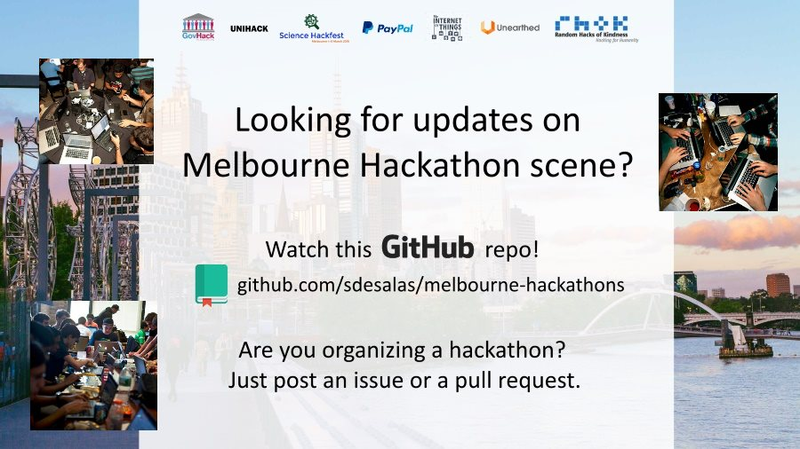

To add a hackathon to this list, please submit an issue or fork this repo and submit a pull request. Inspired by the [Hackathon-Calendar](https://github.com/japacible/Hackathon-Calendar) repo.

## 2016

| Date            | Hackathon                                                | Notes            |
| --------------- | -------------------------------------------------------- | --------------------- |
| 5 - 6 Aug   | [Breaking Law](https://m.facebook.com/events/525430017643156/) | Corporate Law. Lab-14 Carlton Connect |
| 12 - 14 Aug  | [Virtual Reality Hackathon](http://medialab.futureearth.org/anthronaut/melbourne/)   |  City Sustainability Theme. General Assembly, William St. Free. |
| 26 Aug | [Researcher@Library](http://library.unimelb.edu.au/research/researcher@library-week/hackathon) | Sociology Data Hack. Lab 14. Carlton Connect. Free |
| 15 - 16 Oct  | [TADHACK](http://tadhack.com/2016/global/melbourne/)| Telecomms Hack. Telstra Exhibition St CBD. Free. |
| October     | [Unearthed Melbourne](http://unearthed.solutions/events/unearthed-melbourne-2016/)   |  Mining and Resources. Date not announced. |
| November   | [Melb Intern Games Week](http://gamesweek.melbourne/)   |  Game design event. Hackathon very likely. |
| 10 Dec    | [Xamarin Hackday](http://xamarinhackday.com/melbourne/)  | .NET and Xamarin for hybrid apps.   |

### What kind of events are on this list?

- Events that require participants to code and/or design solutions to problems.
- Are based in Melbourne.

### Is this a definitive list?

Not really.  Only some events are widely publicised, a few get cancelled and many are not announced until a couple of months beforehand. 

Make sure you also check the following resources that provide reasonably up-to-date information on hackathons and developer-oriented events in Melbourne:

- [Michelle Mannering's blog](https://hackathongoddess.wordpress.com/) and [Twitter account](https://twitter.com/MishManners/)
- [@HackMelb Twitter Account](https://twitter.com/HackMelb)
- [Twitter search for 'melbourne hackathon'](https://twitter.com/search?q=melbourne%20hackathon&src=typd)
- [Hackathons Australia Facebook page](https://www.facebook.com/groups/hackathonsaustralia/)

### What are some good venues for running a hackathon in Melbourne?

- From the hackathon goddess herself: "There's heaps of them... [LAB-14](http://www.carltonconnect.com.au/about/lab-14/), [Launchpad](http://www.launchpadcentre.com/), [Inspire9](http://inspire9.com/), [York Butter Factory](http://yorkbutterfactory.com/), Zendesk, [CCHS](http://www.hackmelbourne.org/), [NAB Village](http://www.nabvillage.com.au/), [Telstra Innovation Lab](http://exchange.telstra.com.au/2016/04/22/local-innovators-re-think-reality-at-it-hackathon/), [Teamsquare](https://teamsquare.co/), [Swinburne's AMDC Building](http://www.swinburne.edu.au/research/strengths-achievements/contact-us/), to name a few."
